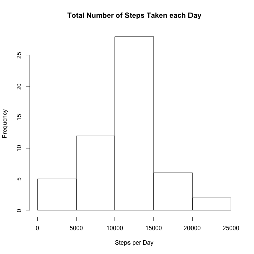
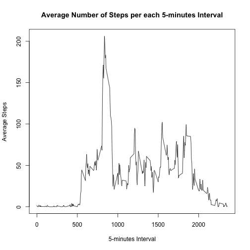
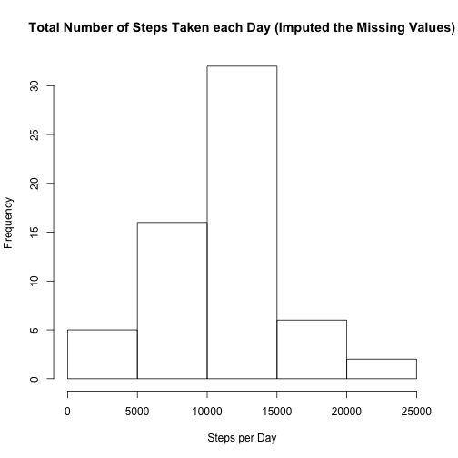
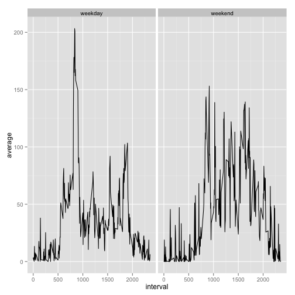

## Loading and preprocessing the data

First, we read the data.


```r
activity.with.na <- read.csv('activity.csv',stringsAsFactors=FALSE)
```


## What is mean total number of steps taken per day?

In order to be able to do statistics on our data set, first we remove the observations that having missing values of 'steps.' 


```r
activity <- na.omit(activity.with.na)
```

Using ddply, we create a table then has the sum of the steps for each day. Note that the dates are measurements interval in one day therefore we can simply we can subset the data based on the 'date' column.


```r
library(plyr)
sum.steps.per.day = ddply(activity,.(date),summarize,sum = sum(steps))
mean.steps   = mean(sum.steps.per.day$sum)
median.steps = median(sum.steps.per.day$sum)
hist(sum.steps.per.day$sum,xlab='Steps per Day',main='Total Number of Steps Taken each Day')
```

 

The mean of total number of steps taken per day is 1.0766 &times; 10<sup>4</sup> while the median is 10765.

## What is the average daily activity pattern?

We can use 'ddply' package once more to make a tabel which contains the average number of steps per each 5-minutes interval. 


```r
ave.steps.per.interval = ddply(activity,.(interval),summarize,average = mean(steps))
max.steps = ave.steps.per.interval$interval[ave.steps.per.interval$average==max(ave.steps.per.interval$average)]
max.steps.formatted = format(as.POSIXct('2014-10-03 12:00:00') + max.steps*5*60, "%I:%M:%S %p")
plot(ave.steps.per.interval$interval,ave.steps.per.interval$average,type='l',
     xlab = '5-minutes Interval',ylab='Average Steps',
     main='Average Number of Steps per each 5-minutes Interval')
```

 

On average across all the days in the dataset, the interval 835 contains the maximum number of steps. Assuming the first measurments is started at 12:00 PM, the 835th interval has started at 09:35:00 AM.

## Imputing missing values

Note that there are a number of days/intervals when there are missing values (coded as NA). The presence of missing days may introduce bias into some calculations or summaries of the data.

Below, I show how one can calculated the total number of missing values.


```r
missing.steps <- is.na(activity.with.na$steps)
number.of.missing.steps <- sum(missing.steps)
```

We find that the total number of missing values is equal to 2304 This is about 13.1% of the total number of observations.

In order to study the impact of imputing missing data on the estimates of the total daily number of steps, I use a strategy for filling in all of the missing values in the dataset. This strategy is adapted from "Data Analysis Using Regression and Multilevel/Hierarchical Models" by Andrew Gelman and Jennifer Hill.


```r
random.imp <- function (df,col){
missing <- is.na(df[col])
n.missing <- sum(missing)
df.obs <- df[col][!missing]
imputed <- df
imputed[col][missing] <- sample (df.obs, n.missing, replace=TRUE)
return (imputed)
}
```


Therefore, I can imput the missing values for steps as follow:


```r
activity.imputed <- random.imp(activity.with.na,'steps')
```


Now, we make a histogram of the total number of steps taken each day and Calculate and compare it with previous analysis.


```r
sum.steps.per.day = ddply(activity.imputed,.(date),summarize,sum = sum(steps))
mean.steps   = mean(sum.steps.per.day$sum)
median.steps = median(sum.steps.per.day$sum)
hist(sum.steps.per.day$sum,xlab='Steps per Day',main='Total Number of Steps Taken each Day (Imputed the Missing Values)')
```

 

For imputed missing value dataset, the mean of total number of steps taken per day is 1.0705 &times; 10<sup>4</sup> while the median is 10600. Note that both mean has changed for only few percents. This was expected as we imputed the missing values based on random replacement of existing values. 

## Are there differences in activity patterns between weekdays and weekends?

To answer this question, I create a new factor variable called 'week' in the dataset with two levels – “weekday” and “weekend” indicating whether a given date is a weekday or weekend day.


```r
activity.imputed$date <- as.Date(activity.imputed[['date']])
activity.imputed$week <- weekdays(activity.imputed$date)
activity.imputed$week[(activity.imputed$week == 'Sunday' | activity.imputed$week == 'Saturday')] <- 'weekend'
activity.imputed$week[!activity.imputed$week == 'weekend'] <- 'weekday'
```

I createa a panel plot of the 5-minute interval and the average number of steps taken, averaged across all weekday days or weekend days using ggplot package.


```r
library(ggplot2)
ave.steps.per.interval = ddply(activity.imputed,.(interval,week),summarize,average = mean(steps))
ggplot(ave.steps.per.interval,aes(interval,average)) + facet_grid(.~ week) + geom_line()
```

 

It can be seen clearly that during the week most of the activities are done earlier in the day (assuming that lower interval refers to earlier times). 
